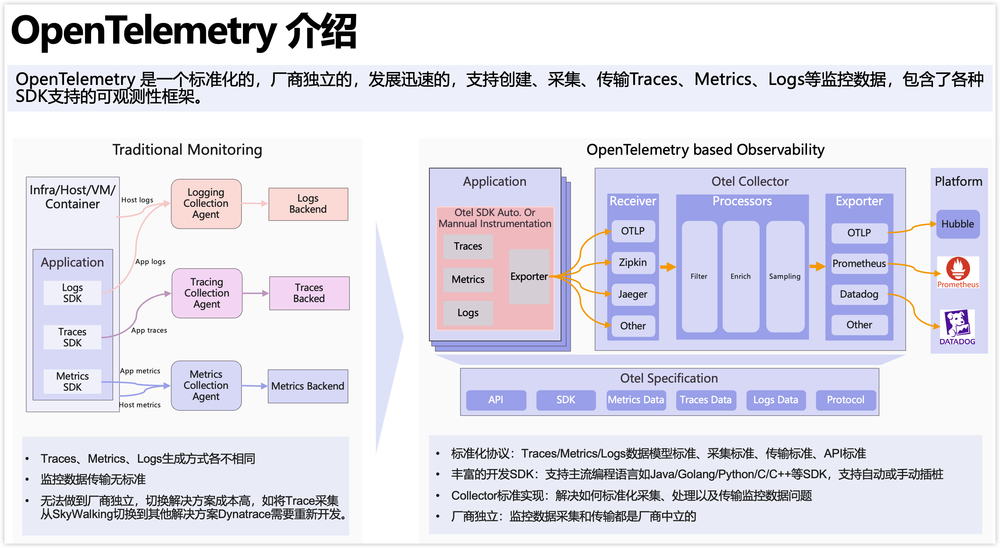
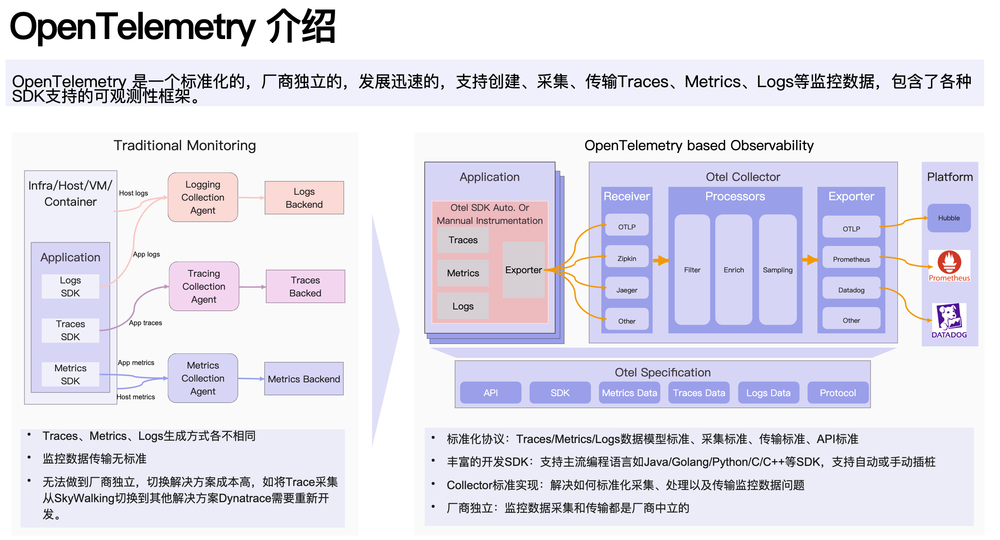

# pptx-renderer

[](https://github.com/aiden0z/pptx-renderer/actions/workflows/ci.yml) [](https://codecov.io/gh/aiden0z/pptx-renderer) [](https://www.npmjs.com/package/@aiden0z/pptx-renderer) [](https://github.com/aiden0z/pptx-renderer/blob/main/LICENSE) [](https://www.typescriptlang.org/) [](https://nodejs.org/) [](https://aiden0z.github.io/pptx-renderer/)

A high-fidelity, browser-native PPTX renderer that parses Office Open XML (`.pptx`) files and renders slides as HTML/SVG DOM.

Supports shapes, text, images, tables, charts, SmartArt, groups, backgrounds, gradients, pattern fills, and the full OOXML color pipeline — covering the vast majority of real-world PowerPoint content.

## Rendering Example

A complex slide with charts, text styles, shapes, and SmartArt — PowerPoint ground truth vs browser-rendered output:

<table>
<tr>
<th>PowerPoint (Ground Truth)</th>
<th>pptx-renderer (Browser)</th>
</tr>
<tr>
<td></td>
<td></td>
</tr>
</table>

## Visual Regression Testing

Every rendering capability is automatically verified against PowerPoint output. **452+ visual regression cases** with zero failures — covering 187+ preset shapes, 134+ SmartArt layouts, 36+ fill/stroke/gradient variants, and 101 python-pptx cases (text, shape adjustments, composites, charts).


<sup>E2E evaluation dashboard: side-by-side ground truth vs rendered output with SSIM, color histogram, and IoU metrics per slide.</sup>

> Ground truth data (PPTX + PDF pairs) is not committed to the repository due to file size. It can be regenerated locally via `scripts/one_shot_full_ground_truth.py` with Microsoft PowerPoint installed (macOS and Windows both supported) — see [`docs/TESTING.md`](docs/TESTING.md) for details.

## Install

```bash
npm install @aiden0z/pptx-renderer
# or
pnpm add @aiden0z/pptx-renderer

# Optional: only needed for SmartArt / EMF files with embedded PDF fallback previews
pnpm add pdfjs-dist
```

Requires Node.js 20+ for development. Runtime is browser-only.

## Quick Start

```ts
import { PptxViewer, RECOMMENDED_ZIP_LIMITS } from '@aiden0z/pptx-renderer';

const container = document.getElementById('pptx-container')!;
const resp = await fetch('/slides/demo.pptx');

// One-liner: parse, build model, and render
const viewer = await PptxViewer.open(await resp.arrayBuffer(), container, {
  zipLimits: RECOMMENDED_ZIP_LIMITS,
  listOptions: { windowed: true },
});
```

For large decks, combine windowed mounting with on-demand slide parsing and media decoding:

```ts
const viewer = await PptxViewer.open(buffer, container, {
  zipLimits: RECOMMENDED_ZIP_LIMITS,
  lazySlides: true,
  lazyMedia: true,
  listOptions: { windowed: true, initialSlides: 4, batchSize: 4 },
});
```

### Optional PDF.js Fallback for SmartArt/EMF Preview Images

PowerPoint often stores SmartArt or pasted vector artwork as EMF fallback images. This
library does **not** implement a full EMF/WMF vector renderer. It can render the common
Office fallback cases where an EMF contains an embedded PDF preview or bitmap preview.

For EMF files with embedded PDF previews, install `pdfjs-dist` and pass explicit asset
URLs. This keeps PDF.js optional and avoids forcing every consumer bundle to include it.
This is only needed for EMF-PDF fallback previews; ordinary PPTX rendering does not
require any code changes.

```ts
import { PptxViewer } from '@aiden0z/pptx-renderer';

const pdfjs = {
  moduleUrl: new URL('pdfjs-dist/build/pdf.min.mjs', import.meta.url).toString(),
  workerUrl: new URL('pdfjs-dist/build/pdf.worker.min.mjs', import.meta.url).toString(),
};

const viewer = await PptxViewer.open(buffer, container, {
  pdfjs,
});
```

If your app uses a CDN or pre-copied assets, point those fields at your hosted files.
Set `pdfjs: false` to disable EMF-PDF fallback rendering entirely. With no `pdfjs`
configuration, the renderer attempts only a best-effort automatic resolution and
otherwise degrades gracefully.

```ts
type PdfjsConfig =
  | {
      moduleUrl?: string;
      workerUrl?: string;
    }
  | false;
```

Or with more control over each step:

```ts
import {
  PptxViewer,
  parseZip,
  buildPresentation,
  RECOMMENDED_ZIP_LIMITS,
} from '@aiden0z/pptx-renderer';

const container = document.getElementById('pptx-container')!;
const viewer = new PptxViewer(container, { fitMode: 'contain' });

const files = await parseZip(arrayBuffer, RECOMMENDED_ZIP_LIMITS);
const presentation = buildPresentation(files);
viewer.load(presentation);
await viewer.renderList({ windowed: true, batchSize: 8 });
```

To delay both media decompression and slide node parsing until rendered slides actually need
them, use `parseZipLazyMedia()` and pass `{ lazySlides: true }` to `buildPresentation()`:

```ts
import {
  PptxViewer,
  parseZipLazyMedia,
  buildPresentation,
  RECOMMENDED_ZIP_LIMITS,
} from '@aiden0z/pptx-renderer';

const files = await parseZipLazyMedia(arrayBuffer, RECOMMENDED_ZIP_LIMITS);
const presentation = buildPresentation(files, { lazySlides: true });

const viewer = new PptxViewer(container);
viewer.load(presentation);
await viewer.renderList({ windowed: true, initialSlides: 4 });
```

## API

### `PptxViewer` (primary, extends `EventTarget`)

#### `PptxViewer.open(input, container, options?)` — Static Factory

Parse, build, and render in one call. Returns a `Promise<PptxViewer>`.

```ts
const viewer = await PptxViewer.open(buffer, container, {
  renderMode: 'list', // 'list' (default) | 'slide'
  zipLimits: RECOMMENDED_ZIP_LIMITS,
  listOptions: { windowed: true, batchSize: 8 },
  signal: abortController.signal, // optional AbortSignal
  // ...ViewerOptions
});
```

#### `new PptxViewer(container, options?)`

| Option             | Type                       | Default     | Description                                                                                                       |
| ------------------ | -------------------------- | ----------- | ----------------------------------------------------------------------------------------------------------------- |
| `width`            | `number`                   | --          | Container width hint (omit for auto-detect)                                                                       |
| `fitMode`          | `'contain' \| 'none'`      | `'contain'` | Responsive fit or fixed size                                                                                      |
| `zoomPercent`      | `number`                   | `100`       | Zoom level (10–400)                                                                                               |
| `scrollContainer`  | `HTMLElement`              | --          | Scroll container for IntersectionObserver root                                                                    |
| `zipLimits`        | `ZipParseLimits`           | --          | Security limits for ZIP parsing (used by `.open()`). Use `RECOMMENDED_ZIP_LIMITS` for untrusted input.            |
| `lazyMedia`        | `boolean`                  | `false`     | Decode embedded media on demand instead of during ZIP parsing. Best for large decks with windowed list rendering. |
| `lazySlides`       | `boolean`                  | `false`     | Parse slide shape/table/chart nodes on demand. Best for large decks with windowed list rendering.                 |
| `pdfjs`            | `PdfjsConfig`              | --          | Optional PDF.js URLs for EMF-embedded PDF fallback rendering, or `false` to disable it.                           |
| `onSlideChange`    | `(index) => void`          | --          | Shorthand for `slidechange` event                                                                                 |
| `onSlideRendered`  | `(index, element) => void` | --          | Shorthand for `sliderendered` event                                                                               |
| `onSlideError`     | `(index, error) => void`   | --          | Shorthand for `slideerror` event                                                                                  |
| `onSlideUnmounted` | `(index) => void`          | --          | Shorthand for `slideunmounted` event                                                                              |
| `onNodeError`      | `(nodeId, error) => void`  | --          | Shorthand for `nodeerror` event                                                                                   |
| `onRenderStart`    | `() => void`               | --          | Shorthand for `renderstart` event                                                                                 |
| `onRenderComplete` | `() => void`               | --          | Shorthand for `rendercomplete` event                                                                              |

All shorthand callbacks are also available as `EventTarget` events (e.g. `viewer.addEventListener('slidechange', ...)`).

#### Instance Methods

```ts
viewer.load(presentation);                              // Load a PresentationData model (no render)
await viewer.renderList({ windowed: true });             // Render all slides in scrollable list
await viewer.renderSlide(0);                             // Render a single slide (no built-in nav UI)

// Load from binary input (parse → build → render). Cleans up previous state on re-open.
await viewer.open(buffer, { renderMode: 'list', signal: abortController.signal });

await viewer.goToSlide(index);                           // Jump to slide (0-based), returns Promise<void>
await viewer.goToSlide(index, { behavior: 'instant' }); // Custom ScrollIntoViewOptions (list mode)
await viewer.setZoom(150);                               // Runtime zoom (10–400)
await viewer.setFitMode('none');                         // Switch fit mode
const matches = viewer.searchText('GPU');                 // Search parsed model text
const hit = await viewer.highlightSearchResult(matches[0]); // Default node overlay highlight
hit?.dispose();
viewer.clearSearchHighlights();                          // Remove active search overlays

// Render a single slide into an external container (React/Vue integration, thumbnails).
// Returns a SlideHandle; caller owns it and must call handle.dispose() when done.
const handle = viewer.renderSlideToContainer(index, container, scale?);
handle.dispose();                                        // Clean up slide-specific resources

// Render a lightweight scaled slide preview into an external container.
// This preserves the original slide layout and uses transform scaling; it is
// not a bitmap thumbnail generator, so use lazy/windowed mounting for decks.
const thumb = viewer.renderThumbnailToContainer(index, sidebarItem, { width: 180 });
await thumb?.ready;
thumb?.dispose();

// Query which slides are currently mounted in the DOM
viewer.isSlideMounted(index);   // boolean
viewer.getMountedSlides();      // number[] (sorted)

// Typed event helpers (return `this` for chaining)
viewer.on('slidechange', (e) => console.log(e.detail.index));
viewer.off('slidechange', listener);

viewer.destroy();               // Cleanup blob URLs, observers, and DOM
viewer[Symbol.dispose]();       // TC39 Explicit Resource Management (calls destroy)
```

#### Text Search

`PptxViewer.searchText(query, options?)` searches the parsed `PresentationData` model,
not the rendered DOM. This keeps search available before or after a slide is mounted and
avoids mutating renderer-generated text runs.

String queries are case-insensitive by default. Pass `matchCase: true` when you need
exact casing. RegExp queries keep their own flags, so `/GPU/` remains case-sensitive
and `/GPU/i` remains case-insensitive.

```ts
import type { TextSearchResult } from '@aiden0z/pptx-renderer';

const matches: TextSearchResult[] = viewer.searchText('GPU', {
  matchCase: false,
  wholeWord: true,
  snippetRadius: 48,
});

const exactMatches = viewer.searchText('GPU', { matchCase: true });
const regexMatches = viewer.searchText(/GPU|CPU/i);

for (const match of matches) {
  await viewer.goToSlide(match.slideIndex, { behavior: 'smooth', block: 'center' });
  // Use match.bounds for node-level highlight overlays in your own UI.
}
```

Each `TextSearchResult` includes `slideIndex`, `nodeId`, `nodePath`, `nodeType`,
`textKind`, full `text`, `matchStart`, `matchEnd`, `snippet`, and `bounds`.
`bounds` is the matched shape or table bounds in intrinsic slide coordinates, so
application code can draw node-level highlight overlays on top of a rendered slide.

The renderer intentionally does not rewrite text nodes for character-level text highlighting.
Character-level text highlighting would require mapping match offsets back to shaped Office
text runs and line layout, which is a separate, higher-risk renderer feature. Today the
stable API boundary is model-level search plus node-level bounds.

For the common UI case, `highlightSearchResult(result, options?)` draws a node-level
overlay using a default highlight style. Pass `SearchHighlightOptions` for custom colors,
spacing, shadows, and class names:

```ts
const hit = await viewer.highlightSearchResult(matches[0], {
  className: 'my-search-hit',
  borderColor: '#22c55e',
  backgroundColor: 'rgba(34, 197, 94, 0.18)',
  borderRadius: 6,
  borderWidth: 2,
  boxShadow: '0 0 0 2px rgba(15, 23, 42, 0.35)',
  padding: 3,
});

// The caller owns returned highlight handles.
hit?.dispose();
viewer.clearSearchHighlights();
```

#### Scaled Slide Previews

`PptxViewer.renderThumbnailToContainer(index, container, options?)` renders a slide at
its intrinsic layout size and applies CSS transform scaling inside a clipped wrapper.
This avoids the layout drift that can happen if a PPTX slide is rendered directly into a
small thumbnail-sized container.

```ts
const thumb = viewer.renderThumbnailToContainer(slideIndex, thumbnailEl, { width: 96 });
await thumb?.ready;

// The caller owns externally rendered previews.
thumb?.dispose();
```

This is not a bitmap thumbnail generator: it still creates a scaled DOM/SVG slide
preview, so large decks should mount previews lazily with `IntersectionObserver` or a
windowed list and dispose handles when they scroll out of view.

#### `ListRenderOptions`

| Option             | Type      | Default | Description                        |
| ------------------ | --------- | ------- | ---------------------------------- |
| `windowed`         | `boolean` | `false` | Use IntersectionObserver windowing |
| `batchSize`        | `number`  | `12`    | Slides per render batch            |
| `initialSlides`    | `number`  | `4`     | Initial slides to mount (windowed) |
| `overscanViewport` | `number`  | `1.5`   | Viewport overscan multiplier       |

#### `ZipParseLimits` and Resource Safety

`parseZip(buffer)` defaults to no ZIP limits for backward compatibility. For files from users or other untrusted sources, pass `RECOMMENDED_ZIP_LIMITS` or stricter values:

| Limit                       | Recommended value | What it protects                            |
| --------------------------- | ----------------- | ------------------------------------------- |
| `maxEntries`                | `4000`            | Archives with excessive file counts         |
| `maxEntryUncompressedBytes` | `32 MiB`          | A single oversized XML/media entry          |
| `maxTotalUncompressedBytes` | `256 MiB`         | Total decompressed archive size             |
| `maxMediaBytes`             | `192 MiB`         | Total media payload size under `ppt/media/` |
| `maxConcurrency`            | `8`               | Parallel ZIP entry reads                    |

When ZIP metadata does not expose a reliable uncompressed size, the parser falls back to the actual decoded entry size before accepting the entry. This keeps `maxEntryUncompressedBytes`, `maxTotalUncompressedBytes`, and `maxMediaBytes` effective for XML/text entries and media entries alike.

Renderer-level guards also apply after ZIP parsing:

- Chart caches do not allocate from oversized `c:ptCount`; chart point indexes are capped at `10,000` per cache.
- EMF bitmap previews are rejected when decoded size exceeds `16,777,216` pixels, dimensions exceed `8192x8192`, or pixel payload is shorter than the declared bitmap.
- External audio/video relationships only render for safe `http`/`https` URLs with `TargetMode="External"` and are created with `preload="none"`.

#### Events (`PptxViewerEventMap`)

```ts
viewer.addEventListener('renderstart', () => {
  /* render cycle began */
});
viewer.addEventListener('rendercomplete', () => {
  /* render cycle finished (fires even on error) */
});
viewer.addEventListener('slidechange', (e) => console.log(e.detail.index));
viewer.addEventListener('sliderendered', (e) => console.log(e.detail.index, e.detail.element));
viewer.addEventListener('slideerror', (e) => console.error(e.detail.index, e.detail.error));
viewer.addEventListener('slideunmounted', (e) => console.log(e.detail.index));
viewer.addEventListener('nodeerror', (e) => console.warn(e.detail.nodeId, e.detail.error));
```

`slidechange` fires both on `goToSlide()` navigation and after each render cycle (initial render included). `renderstart`/`rendercomplete` bracket every render cycle (renderList, renderSlide, setZoom, setFitMode). When calls overlap, the newer render request supersedes older queued or batched work, so stale list batches stop before appending more DOM.

#### Instance Properties (read-only)

```ts
viewer.presentationData; // PresentationData | null — the parsed model, null before load()
viewer.slideCount; // number — total slides (0 if not loaded)
viewer.slideWidth; // number — intrinsic slide width in px
viewer.slideHeight; // number — intrinsic slide height in px
viewer.currentSlideIndex; // number — currently active slide (0-based)
viewer.isRendering; // boolean — true between renderstart and rendercomplete
viewer.zoomPercent; // number — current zoom level (e.g. 100, 200)
viewer.fitMode; // FitMode — current fit mode ('contain' | 'none')
```

### `PptxRenderer` (deprecated v1 compat)

`PptxRenderer` extends `PptxViewer` and provides the legacy `preview(input)` API with built-in nav buttons in slide mode. Migrate to `PptxViewer` for new code.

```ts
import { PptxRenderer } from '@aiden0z/pptx-renderer';

const renderer = new PptxRenderer(container, { mode: 'list', listMountStrategy: 'windowed' });
await renderer.preview(buffer); // deprecated — use PptxViewer.open() instead
```

`PptxRenderer` accepts the same optional `lazyMedia`, `lazySlides`, and `pdfjs`
configuration as `PptxViewer`, so legacy users can enable performance options or
EMF-PDF fallback rendering without changing APIs.

### Utility Exports

```ts
import {
  parseZip,
  parseZipLazyMedia,
  buildPresentation,
  materializeAllSlideNodes,
  serializePresentation,
  buildTextIndex,
  searchText,
  searchPresentation,
  RECOMMENDED_ZIP_LIMITS,
} from '@aiden0z/pptx-renderer';

const files = await parseZip(arrayBuffer, RECOMMENDED_ZIP_LIMITS); // PptxFiles
const lazyFiles = await parseZipLazyMedia(arrayBuffer, RECOMMENDED_ZIP_LIMITS); // media resolves on demand
const presentation = buildPresentation(files); // PresentationData
const lazyPresentation = buildPresentation(lazyFiles, { lazySlides: true }); // slide nodes parse on demand
materializeAllSlideNodes(lazyPresentation); // optional: force full model materialization
const json = serializePresentation(presentation); // SerializedPresentation (JSON-safe)
const index = buildTextIndex(presentation); // TextIndexEntry[]
const matches = searchText(index, '算力'); // TextSearchResult[]
const directMatches = searchPresentation(presentation, /GPU|CPU/i); // TextSearchResult[]
```

#### Headless Slide Rendering

For advanced use cases (server-side screenshot, custom rendering pipeline):

```ts
import { renderSlide } from '@aiden0z/pptx-renderer';
import type { SlideHandle } from '@aiden0z/pptx-renderer';

const handle = renderSlide(presentation, presentation.slides[0], {
  onNodeError: (nodeId, err) => console.warn(nodeId, err),
  mediaUrlCache: new Map(), // optional shared cache for blob URLs
  pdfjs, // optional, only for EMF-embedded PDF fallback rendering
});
document.body.appendChild(handle.element);

// Await async media such as EMF-PDF fallback previews before screenshots/exports.
await handle.ready;

// Clean up when done (disposes charts + blob URLs in standalone mode)
handle.dispose();
```

#### Model Types

All model types are exported for consumers building custom tooling:

```ts
import type {
  PresentationData,
  BuildPresentationOptions,
  SlideData,
  SlideNode,
  ThemeData,
  BaseNodeData,
  ShapeNodeData,
  PicNodeData,
  TableNodeData,
  GroupNodeData,
  ChartNodeData,
  TextBody,
  TextParagraph,
  TextRun,
  Position,
  Size,
  NodeType,
  SerializedPresentation,
  SerializedSlide,
  SerializedNode,
  PptxFiles,
  ZipParseLimits,
  FitMode,
  PreviewInput,
  ViewerOptions,
  ListRenderOptions,
  ThumbnailRenderOptions,
  SearchHighlightHandle,
  SearchHighlightOptions,
  PptxViewerEventMap,
  SlideHandle,
  PdfjsOptions,
  PdfjsConfig,
  TextBounds,
  TextIndexEntry,
  TextIndexOptions,
  TextSearchOptions,
  TextSearchResult,
} from '@aiden0z/pptx-renderer';
```

## Rendering Capabilities

### Shapes — 187+ Presets + Custom Geometry

All commonly used OOXML `DrawingML` preset shapes, organized by category:

| Category          | Count | Highlights                                                     |
| ----------------- | ----: | -------------------------------------------------------------- |
| Basic & Geometric |    70 | Rectangles, ovals, polygons, stars, arcs, clouds, gears, etc.  |
| Flowchart         |    30 | All standard flowchart shapes                                  |
| Arrows            |    22 | Directional, bent, curved, striped, chevron                    |
| Stars & Banners   |    17 | N-point stars, explosions, ribbons, scrolls                    |
| Callouts          |    17 | Rectangular, rounded, oval, cloud, line callout variants       |
| Connectors        |    12 | Straight, bent, curved (2-5 segments)                          |
| Action Buttons    |     9 | Multi-path 3D with darken/lighten face modifiers               |
| Math & Brackets   |    12 | Plus, minus, multiply, division, brackets, braces              |
| **Multi-path 3D** |   33+ | Bevel, cube, can, ribbons — multi-layer SVG with 3D appearance |

Custom geometry (`<a:custGeom>`) is also supported via a general-purpose OOXML path interpreter.

### Text — 7-Level Style Inheritance

Full OOXML text cascade: master → layout → shape → paragraph → run. Supports theme fonts, numbered/symbol/picture bullets, multi-level indent, vertical text, superscript/subscript, hyperlinks, and per-shape text insets.

### Charts via ECharts

Powered by [ECharts](https://echarts.apache.org/). Supports Bar/Column (clustered, stacked, 100% stacked), Line/Area (standard, stacked, 100% stacked), Pie, multi-ring Doughnut, Radar, Scatter, Bubble, and Stock/Candlestick charts, with axis labels, legends, data labels, grid lines, chart color-style palettes, marker symbols, and custom number formats.

OOXML 3D chart elements such as `bar3DChart`, `line3DChart`, `pie3DChart`, `area3DChart`, and `surface3DChart` are parsed as graceful 2D fallbacks where possible. True 3D perspective, depth walls, and surface meshes are not PowerPoint-perfect.

### Fill, Stroke & Color

- **Fills**: solid, linear/radial/rectangular gradient, 52+ pattern fills, image (stretch/tile)
- **Strokes**: 8 dash styles, 5 arrowhead types, compound lines, line joins
- **Colors**: full OOXML pipeline — `schemeClr` → `colorMap` remap → theme lookup → modifiers (lumMod, lumOff, tint, shade, alpha, satMod, etc.). All 6 color spaces supported.

### SmartArt, Tables, Images & More

- **SmartArt**: 134+ layouts via PowerPoint fallback data. EMF-embedded PDF previews can be rendered with optional [pdfjs-dist](https://mozilla.github.io/pdf.js/) configuration.
- **Tables**: OOXML table styles, cell merge, border inheritance
- **Images**: blob URL with crop, stretch/tile, video/audio placeholders
- **Groups**: coordinate remapping with recursive child rendering
- **Backgrounds**: slide → layout → master inheritance chain

## Architecture

Three-layer pipeline: **Parse -> Model -> Render**

```
ArrayBuffer (.pptx)
  -> ZipParser (jszip extraction)
  -> XmlParser (DOMParser + SafeXmlNode null-safe wrapper)
  -> buildPresentation() (assembles slides/layouts/masters/themes with relationship chains)
  -> SlideRenderer (background -> master shapes -> layout shapes -> slide shapes -> DOM)
```

Key design decisions:

- **SafeXmlNode**: Null-safe XML traversal — returns empty nodes instead of null, enabling deep chaining without null checks.
- **Lazy slide parsing**: Optional `lazySlides` mode keeps per-slide nodes deferred until render, search, serialization, or explicit materialization.
- **Lazy group parsing**: Group children stored as raw XML, parsed during rendering to avoid deep recursion in model layer.
- **Error isolation**: Per-node try/catch. A failed shape renders as a dashed-red placeholder; the slide continues.
- **No external CSS**: All styles inline. The library outputs self-contained HTML fragments.
- **Blob URL lifecycle**: Created for images/media, tracked in `mediaUrlCache`, revoked on `destroy()`.

## Performance

For large decks (50+ slides), use windowed mounting and opt-in lazy parsing:

```ts
const viewer = await PptxViewer.open(buffer, container, {
  zipLimits: RECOMMENDED_ZIP_LIMITS,
  lazySlides: true,
  lazyMedia: true,
  listOptions: {
    windowed: true,
    batchSize: 8,
    initialSlides: 4,
    overscanViewport: 1.5,
  },
});
```

Details: [`docs/PERFORMANCE.md`](docs/PERFORMANCE.md)

## Security

- Treat PPTX input as untrusted. Start with `RECOMMENDED_ZIP_LIMITS`, then tighten for your deployment.
- External hyperlinks are protocol-filtered (no `javascript:`, `data:`, etc.).
- Reporting: [`docs/SECURITY.md`](docs/SECURITY.md)

## Development

```bash
pnpm install
pnpm dev          # Vite dev server
pnpm test         # Unit tests (vitest)
pnpm test:coverage # Coverage report → coverage/
pnpm build        # Production build
pnpm dev:e2e      # Dev server + Python E2E API server
pnpm lint         # ESLint
pnpm typecheck    # tsc --noEmit
pnpm knip         # Dead code / unused exports detection
```

Dev pages at `http://127.0.0.1:5173`:

| Page                            | Purpose                                   |
| ------------------------------- | ----------------------------------------- |
| `/test/pages/index.html`        | Upload preview with search and thumbnails |
| `/test/pages/render-slide.html` | Single slide at native resolution         |
| `/test/pages/e2e-compare.html`  | Side-by-side PDF vs HTML with SSIM scores |
| `/test/pages/export.html`       | Model JSON tree viewer                    |

## Documentation

| Doc                                       | Content                                                                |
| ----------------------------------------- | ---------------------------------------------------------------------- |
| [`ARCHITECTURE.md`](docs/ARCHITECTURE.md) | Parse/model/render pipeline design                                     |
| [`PERFORMANCE.md`](docs/PERFORMANCE.md)   | Tuning options and presets                                             |
| [`TESTING.md`](docs/TESTING.md)           | Unit/E2E strategy, two-layer metric system, visual regression workflow |
| [`CONTRIBUTING.md`](docs/CONTRIBUTING.md) | PR checklist, code quality tools, and workflow                         |
| [`SECURITY.md`](docs/SECURITY.md)         | Vulnerability reporting                                                |

## What's Not Yet Supported

3D effects, true 3D chart perspective/depth/surface meshes, animations/transitions, equations (OMML), full EMF/WMF vector rendering, shadow/reflection/glow effects, embedded OLE objects, and slide notes rendering.

## FAQ

**Does this run on Node.js?**
No. Rendering depends on browser DOM APIs.

**Why is my PPTX rendering incomplete?**
OOXML is a vast spec. Please open a compatibility issue with a minimal PPTX sample — the visual regression pipeline makes it straightforward to add coverage for new cases.

**How do I render 100+ slide decks efficiently?**
Use `windowed: true` in `listOptions`, and enable `lazySlides: true`. For media-heavy
decks, also enable `lazyMedia: true`.

## License

Apache License 2.0. See `LICENSE`.
